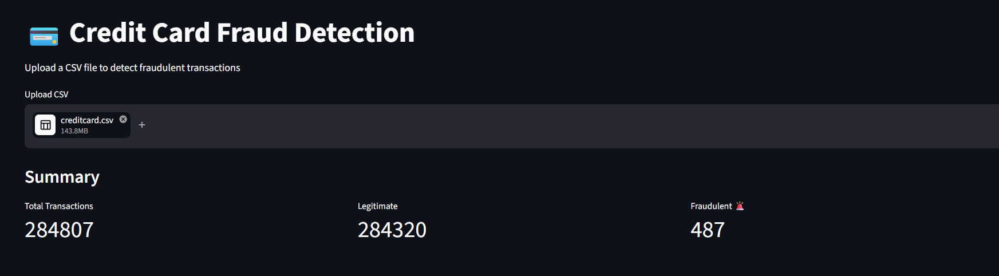
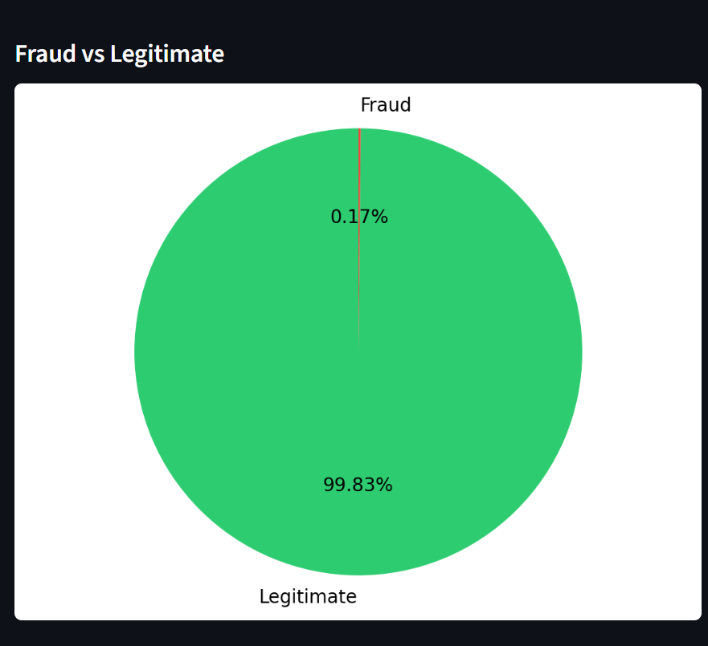
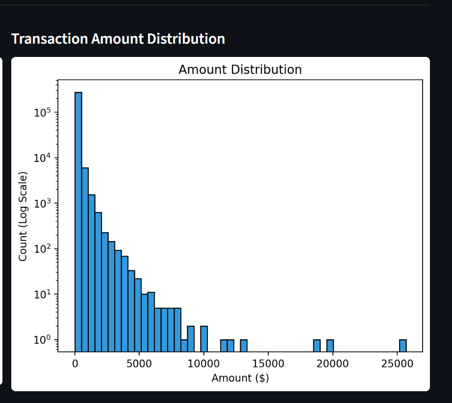
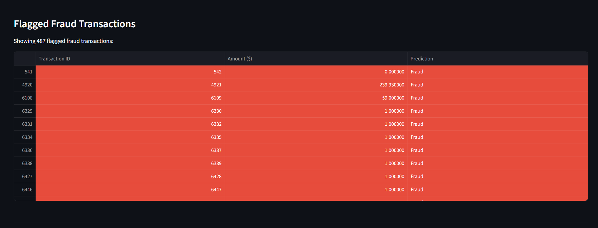

# 💳 Credit Card Fraud Detection

ML-based system to detect fraudulent credit card transactions using Random Forest, SMOTE, and Streamlit.

---

## 📊 Results Summary

| Metric | Value |
|---|---|
| Dataset Size | 284,807 transactions |
| Fraud Cases | 492 (0.17%) |
| Best Model | Random Forest |
| AUC Score | 0.97 |
| Fraud Caught | 81 out of 98 |
| False Alarms | Only 12 |

---

## 📈 Visualizations

### Fraud vs Legitimate

### Transaction Amount Distribution

### Flagged Fraud Transactions

---

## 🛠 Tech Stack
- Python
- Scikit-learn
- Imbalanced-learn (SMOTE)
- XGBoost
- Streamlit
- Pandas, Matplotlib, Seaborn

---

## 🚀 How to Run

1. Download dataset from [Kaggle](https://www.kaggle.com/datasets/mlg-ulb/creditcardfraud)
2. Place `creditcard.csv` in the project folder
3. Install dependencies:
   pip install scikit-learn imbalanced-learn xgboost streamlit pandas matplotlib seaborn joblib
4. Run the app:
   streamlit run app.py

---

## 🧠 Approach

- Loaded real dataset with 284,807 transactions
- Identified severe class imbalance — only 0.17% fraud
- Applied SMOTE to balance training data
- Trained and compared 3 models:
  - Logistic Regression
  - Random Forest
  - XGBoost
- Random Forest selected as best model (AUC 0.97)
- Built Streamlit web app with:
  - Summary metrics
  - Pie chart
  - Amount distribution histogram
  - Fraud transactions table highlighted in red
  - CSV download button

---

## 📁 Dataset

Download from Kaggle: [Credit Card Fraud Detection](https://www.kaggle.com/datasets/mlg-ulb/creditcardfraud)

Dataset is not included in this repo due to GitHub file size limits (143MB).
